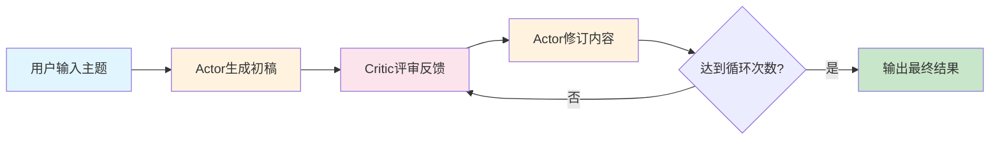
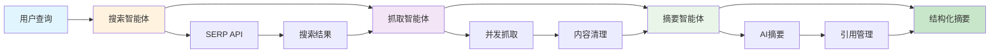
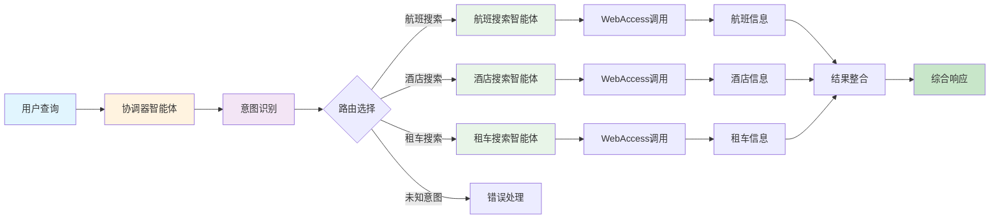
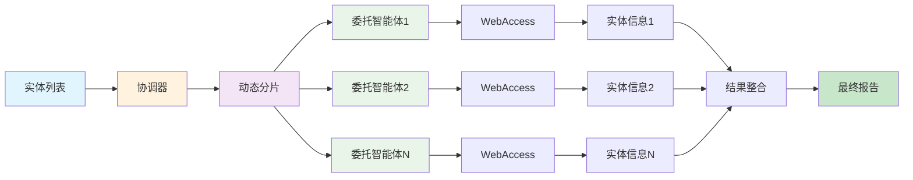

# 🤖 Agentic Workflow Cases

[](https://www.python.org/downloads/)
[](LICENSE)
[](https://github.com/Maplemx/Agently)

智能体工作流（Agentic Workflow）应用案例的项目集合。通过多个精心设计的案例，演示如何使用AI智能体协作完成复杂任务，涵盖内容创作、信息检索、数据处理等多个领域。

## 🎯 项目概述

Agentic Workflow（智能体工作流）是一种新兴的AI应用模式，通过多个专门化的AI智能体协作，完成单个AI难以胜任的复杂任务。本项目收集并实现了多个典型的Agentic Workflow案例，每个案例都展示了不同的协作模式和应用场景。

### 核心特点

- 🔄 **多智能体协作**：展示不同智能体间的协作模式
- 🎨 **多样化场景**：涵盖内容创作、信息检索、数据分析等领域
- 🛠️ **模块化设计**：每个案例都是独立的模块，易于理解和扩展
- 📚 **详细文档**：每个案例都有完整的说明文档和使用指南
- 🔧 **易于扩展**：提供统一的基础设施，便于添加新案例

## 📁 工作流案例详解

### 1. 🔄 Reflection Workflow - 反思式内容创作工作流

基于Actor-Critic模式的智能反思工作流系统，通过参与者和评论者的多轮协作，实现内容的持续改进和优化。

**核心特性：**
- Actor-Critic协作模式
- 多轮迭代优化
- 完整状态追溯
- 智能反馈机制

**应用场景：**
- 学术论文写作和改进
- 技术文档的迭代优化
- 创意内容的反思式创作

**详细文档：** [reflection/README.md](reflection/README.md)

#### 工作流程图



**工作流程：**
1. **初始创作**：Actor根据主题生成初始草稿
2. **专业评审**：Critic提供同行评议级别的反馈
3. **迭代改进**：Actor根据反馈系统性修订内容
4. **循环优化**：重复评审-修订过程直到达到预设轮次
5. **状态追溯**：完整记录每轮的草稿和评审历史

#### 使用示例

```python
from reflection.main import Runner

def run_reflection_example():
    """运行反思工作流示例"""

    # 配置参数
    topic = "人工智能在教育领域的应用与挑战"
    num_cycles = 3

    # 创建工作流实例
    runner = Runner(topic, num_cycles)

    # 执行工作流
    print(f"开始执行反思工作流，主题：{topic}")
    print(f"计划执行 {num_cycles} 轮迭代...")

    final_result = runner.run()

    # 查看结果
    print("工作流执行完成！")
    print(f"最终结果长度：{len(final_result)} 字符")

    # 查看完整历史
    state_manager = runner.state_manager
    markdown_history = state_manager.to_markdown()

    # 保存历史记录
    with open("reflection_history.md", "w", encoding="utf-8") as f:
        f.write(markdown_history)

    print("完整历史已保存到 reflection_history.md")

if __name__ == "__main__":
    run_reflection_example()
```

### 2. 🌐 Web Access Workflow - 智能网络搜索工作流

基于多智能体协作的网络信息检索和摘要生成系统，通过搜索、抓取、摘要三个智能体的协作，实现从查询到摘要的完整信息处理流程。

**核心特性：**
- 三阶段流水线处理
- 智能查询优化
- 并发网页抓取
- AI驱动摘要生成

**应用场景：**
- 新闻事件快速调研
- 学术研究背景收集
- 市场分析和竞品调研
- 信息整理和摘要生成

**详细文档：** [web_access/README.md](web_access/README.md)

#### 工作流程图



**工作流程：**
1. **智能搜索**：AI优化查询词，调用搜索API获取结果
2. **并发抓取**：多线程抓取网页内容，智能去噪处理
3. **摘要生成**：AI分析内容生成结构化摘要，自动添加引用

#### 使用示例

```python
from web_access.main import WebAccess

def run_web_access_example():
    """运行网络搜索工作流示例"""

    # 创建工作流实例
    web_access = WebAccess()

    # 定义查询
    queries = [
        "ChatGPT最新功能更新",
        "2024年人工智能发展趋势",
        "大模型在企业中的应用案例"
    ]

    for query in queries:
        print(f"\n处理查询：{query}")
        print("-" * 50)

        try:
            # 执行完整流程
            web_access.run(query, location="china")
            print(f"✅ 查询 '{query}' 处理完成")

        except Exception as e:
            print(f"❌ 查询 '{query}' 处理失败：{str(e)}")

    print("\n所有查询处理完成！")
    print("结果文件保存在 web_access/data/output/ 目录下")

if __name__ == "__main__":
    run_web_access_example()
```

### 3. 🎯 Semantic Router Workflow - 语义路由智能旅行规划工作流

基于语义路由和意图识别的智能旅行规划系统，通过协调器智能体和专业子智能体的协作，实现自然语言查询的智能路由和统一服务整合。

**核心特性：**
- 智能意图识别和语义路由
- 多领域专业智能体协作
- 统一的旅行服务整合
- 自然语言查询处理

**应用场景：**
- 智能旅行助手和规划
- 多服务统一入口平台
- 客服机器人智能路由
- 意图识别和分类系统

#### 工作流程图



**工作流程：**
1. **查询接收**：用户提交自然语言旅行查询
2. **意图识别**：协调器分析查询内容，识别用户意图（航班/酒店/租车）
3. **智能路由**：根据识别的意图路由到相应的专业子智能体
4. **信息获取**：子智能体优化查询并调用WebAccess获取相关信息
5. **结果整合**：协调器整合子智能体结果，生成统一的综合响应

#### 使用示例

```python
from semantic_router.main import SemanticRouter

def run_semantic_router_example():
    """运行语义路由工作流示例"""

    # 创建语义路由器实例
    router = SemanticRouter()

    # 定义不同类型的旅行查询
    queries = [
        "你能推荐几家武汉汉阳的酒店我下周入住吗？",
        "我想预订下周从北京到上海的航班",
        "在广州租车一周大概多少钱？",
        "帮我找找深圳性价比高的酒店"
    ]

    for query in queries:
        print(f"\n处理查询：{query}")
        print("-" * 50)

        try:
            # 执行语义路由和处理
            response = router.run(query)
            print(f"✅ 响应：{response}")

        except Exception as e:
            print(f"❌ 查询处理失败：{str(e)}")

    print("\n所有查询处理完成！")

if __name__ == "__main__":
    run_semantic_router_example()
```

### 4. 🔀 Dynamic Sharding Workflow - 动态分片智能信息处理工作流

基于协调器-委托智能体模式的动态分片信息处理系统，通过智能分片和异步并发处理，实现大量实体数据的批量信息获取和整合。

**核心特性：**
- 动态分片处理机制
- 协调器-委托智能体协作
- 异步并发优化
- 智能信息获取集成

**应用场景：**
- 批量人物信息收集
- 企业信息调研
- 学术研究支持
- 知识图谱构建

**详细文档：** [dynamic_sharding/README.md](dynamic_sharding/README.md)

#### 工作流程图



**工作流程：**
1. **动态分片**：协调器根据配置将实体列表分割为多个分片
2. **并发处理**：为每个分片创建委托智能体，异步并发处理
3. **信息获取**：每个委托智能体调用WebAccess获取实体详细信息
4. **结果整合**：收集所有分片结果，生成完整的信息报告

#### 使用示例

```python
import asyncio
from dynamic_sharding.main import run

def run_dynamic_sharding_example():
    """运行动态分片工作流示例"""

    # 配置参数
    input_file = "dynamic_sharding/data/entities.txt"
    output_file = "dynamic_sharding/data/entity_info.txt"
    shard_size = 3  # 每个分片包含3个实体

    print(f"开始执行动态分片工作流...")
    print(f"输入文件：{input_file}")
    print(f"输出文件：{output_file}")
    print(f"分片大小：{shard_size}")

    try:
        # 执行异步工作流
        asyncio.run(run(input_file, output_file, shard_size))

        print("✅ 动态分片工作流执行完成！")
        print(f"结果已保存到：{output_file}")

        # 读取并显示结果摘要
        with open(output_file, 'r', encoding='utf-8') as f:
            content = f.read()
            print(f"生成内容长度：{len(content)} 字符")

    except Exception as e:
        print(f"❌ 工作流执行失败：{str(e)}")

if __name__ == "__main__":
    run_dynamic_sharding_example()
```

## 🚀 快速开始

### 1. 克隆项目

```bash
git clone https://github.com/your-username/agentic_workflow_case.git
cd agentic_workflow_case
```

### 2. 安装依赖

```bash
pip install -r requirements.txt
```

### 3. 配置环境变量

创建 `.env` 文件并配置必要的API密钥：

```env
# AI模型API配置
AGENTLY_API_KEY=your_agently_api_key
DOUBAO_API_KEY=your_doubao_api_key

# 搜索API配置（用于web_access案例）
SERPAPI_API_KEY=your_serpapi_key
```

### 4. 运行案例

```bash
# 运行反思工作流案例
cd reflection
python main.py

# 运行网络搜索工作流案例
cd web_access
python main.py

# 运行语义路由工作流案例
cd semantic_router
python main.py

# 运行动态分片工作流案例
cd dynamic_sharding
python main.py
```

## ⚙️ 环境配置

### 系统要求

- Python 3.8+
- 8GB+ RAM（推荐）
- 稳定的网络连接

### 依赖包

```txt
agently>=0.1.0
requests>=2.28.0
beautifulsoup4>=4.11.0
python-dotenv>=0.19.0
loguru>=0.6.0
```

### API服务

| 服务 | 用途 | 必需性 | 获取方式 |
|------|------|--------|----------|
| 豆包API | AI模型调用 | 必需 | [豆包开放平台](https://www.volcengine.com/product/doubao) |
| SERP API | 网络搜索 | web_access案例必需 | [SerpApi](https://serpapi.com/) |

## 📂 项目结构

```
agentic_workflow_case/
├── README.md                    # 项目主文档
├── requirements.txt             # 依赖包列表
├── .env.example                # 环境变量模板
├── utils/                       # 公共工具模块
│   ├── ChatModel.py            # AI模型接口封装
│   ├── logger.py               # 日志配置
│   ├── save_to_disk.py         # 文件保存工具
│   └── manage.py               # 项目管理工具
├── reflection/                  # 反思工作流案例
│   ├── README.md               # 案例详细文档
│   ├── main.py                 # 主程序入口
│   ├── actor.py                # Actor智能体实现
│   ├── critic.py               # Critic智能体实现
│   ├── prompts.py              # 提示词定义
│   └── data/                   # 数据存储目录
├── web_access/                  # 网络搜索工作流案例
│   ├── README.md               # 案例详细文档
│   ├── main.py                 # 主程序入口
│   ├── search.py               # 搜索智能体
│   ├── scrape.py               # 抓取智能体
│   ├── summarize.py            # 摘要智能体
│   ├── serp.py                 # 搜索API客户端
│   ├── prompts.py              # 提示词定义
│   └── data/                   # 数据存储目录
├── semantic_router/             # 语义路由工作流案例
│   ├── main.py                 # 主程序入口
│   ├── coordinator.py          # 协调器智能体
│   ├── hotel_search.py         # 酒店搜索智能体
│   ├── flight_search.py        # 航班搜索智能体
│   ├── car_rental_search.py    # 租车搜索智能体
│   └── prompts.py              # 提示词定义
├── dynamic_sharding/            # 动态分片工作流案例
│   ├── README.md               # 案例详细文档
│   ├── main.py                 # 主程序入口
│   ├── coordinator.py          # 协调器智能体
│   ├── delegate.py             # 委托智能体
│   ├── message.py              # 消息传递结构
│   └── data/                   # 数据存储目录
├── test/                        # 测试文件目录
└── logs/                        # 日志文件目录
```

## 📄 许可证

本项目采用 MIT 许可证。详见 [LICENSE](LICENSE) 文件。

## 🙏 致谢

- [Agently](https://github.com/Maplemx/Agently) - 优秀的 AI agently 开发框架
- [豆包](https://www.volcengine.com/product/doubao) - 强大的大语言模型服务
- [SerpApi](https://serpapi.com/) - 可靠的搜索API服务

## 📞 联系我们

- **项目维护者**: justin.郑
- **邮箱**: 3907721@qq.com
- **Issues**: [GitHub Issues](https://github.com/your-username/agentic_workflow_case/issues)

---

⭐ 如果这个项目对你有帮助，请给我们一个星标！

🔄 持续更新中，更多精彩的Agentic Workflow案例即将到来...

