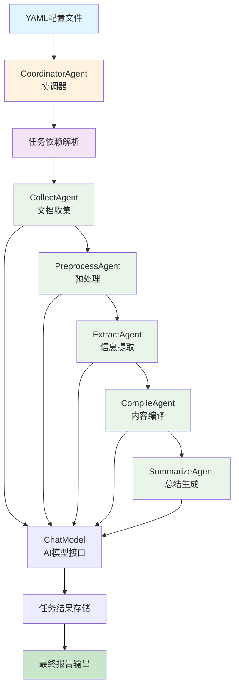

# DAG编排智能体工作流说明文档

## 概述

DAG编排智能体（DAG Orchestration Agent）是一个基于有向无环图（Directed Acyclic Graph）的智能文档处理系统。该系统通过协调器（Coordinator）和多个专门的智能体（Agents）协作，按照预定义的依赖关系和执行顺序，自动化处理复杂的文档分析和处理任务。

### 核心理念

- **DAG编排**：基于有向无环图的任务编排，确保任务按正确的依赖顺序执行
- **智能体协作**：多个专门的智能体协同工作，每个智能体负责特定的处理环节
- **异步并行**：支持无依赖关系的任务并行执行，提高处理效率
- **动态加载**：通过YAML配置文件动态定义任务流程和智能体配置
- **结果传递**：任务间的输出自动作为下游任务的输入，形成完整的处理链

## 系统架构



## 核心组件

### 1. DagOrchestrationAgent（主入口）
- **职责**：系统的主入口和流程控制
- **功能**：
  - 初始化协调器智能体
  - 管理DAG配置文件路径
  - 保存最终处理结果
  - 处理系统级异常和日志

### 2. CoordinatorAgent（协调器）
- **职责**：DAG任务编排和智能体协调
- **功能**：
  - 从YAML文件加载DAG定义
  - 解析任务依赖关系
  - 动态创建和管理智能体实例
  - 协调任务的并行和串行执行
  - 管理任务状态和结果传递

### 3. 专门智能体（Specialized Agents）
- **CollectAgent（文档收集智能体）**：负责从指定文件夹收集文档并提取标题
- **PreprocessAgent（预处理智能体）**：对收集的文档进行清洗和预处理
- **ExtractAgent（信息提取智能体）**：从预处理后的文档中提取关键信息
- **CompileAgent（编译智能体）**：将提取的信息进行整合和编译
- **SummarizeAgent（总结智能体）**：生成最终的分析报告和总结

## 详细流程说明

### 1. 配置加载阶段
1. **YAML配置解析**
   - 从dag.yml文件加载任务定义
   - 解析每个任务的ID、名称、描述、智能体类型和依赖关系
   - 初始化任务状态管理

2. **智能体映射**
   - 建立智能体类名到模块的映射关系
   - 支持动态导入和实例化智能体

### 2. DAG执行阶段
1. **依赖关系分析**
   - 分析任务间的依赖关系
   - 识别可并行执行的任务组
   - 确保无循环依赖

2. **任务调度执行**
   - 按依赖顺序执行任务
   - 支持无依赖任务的并行执行
   - 实时监控任务状态（pending/running/completed/failed）

3. **结果传递机制**
   - 上游任务的输出自动作为下游任务的输入
   - 支持单依赖和多依赖的数据传递
   - 维护完整的任务结果链

### 3. 智能体处理阶段
每个智能体都遵循统一的处理模式：
1. **接收消息**：从协调器接收包含输入数据的消息
2. **AI处理**：调用ChatModel进行智能化处理
3. **结果返回**：将处理结果封装为消息返回给协调器

## 文件结构

```
dag_orchestration/
├── main.py                  # 主程序入口
├── coordinator.py           # DAG协调器实现
├── agents/                  # 智能体模块目录
│   ├── collect.py          # 文档收集智能体
│   ├── preprocess.py       # 预处理智能体
│   ├── extract.py          # 信息提取智能体
│   ├── compile.py          # 编译智能体
│   └── summarize.py        # 总结智能体
└── README.md               # 本说明文档
```

## 配置和使用

### 环境要求
- Python 3.8+
- Agently 框架
- asyncio 支持
- PyYAML
- AI模型API访问权限

### DAG配置文件示例

```yaml
# dag.yml
tasks:
  - id: collect
    name: DocumentCollector
    agent: CollectAgent
    description: "收集指定文件夹中的文档"
    dependencies: []
    
  - id: preprocess
    name: DocumentPreprocessor
    agent: PreprocessAgent
    description: "对收集的文档进行预处理"
    dependencies: [collect]
    
  - id: extract
    name: InformationExtractor
    agent: ExtractAgent
    description: "从预处理文档中提取关键信息"
    dependencies: [preprocess]
    
  - id: compile
    name: ContentCompiler
    agent: CompileAgent
    description: "编译和整合提取的信息"
    dependencies: [extract]
    
  - id: summarize
    name: ReportSummarizer
    agent: SummarizeAgent
    description: "生成最终分析报告"
    dependencies: [compile]
```

### 基本使用

```python
import asyncio
from dag_orchestration.main import DagOrchestrationAgent

async def run_dag_orchestration_example():
    """运行DAG编排工作流示例"""
    
    # 创建DAG编排实例
    dag_agent = DagOrchestrationAgent()
    
    print("开始执行DAG编排工作流...")
    print(f"DAG配置文件：{dag_agent.dag_file_path}")
    print(f"输出报告文件：{dag_agent.report_file_path}")
    
    try:
        # 执行DAG编排流程
        await dag_agent.run()
        
        print("✅ DAG编排工作流执行完成！")
        print(f"最终报告已保存到：{dag_agent.report_file_path}")
        
        # 读取并显示结果摘要
        with open(dag_agent.report_file_path, 'r', encoding='utf-8') as f:
            content = f.read()
            print(f"生成报告长度：{len(content)} 字符")
            
    except Exception as e:
        print(f"❌ 工作流执行失败：{str(e)}")

if __name__ == "__main__":
    asyncio.run(run_dag_orchestration_example())
```

### 自定义配置

```python
# 自定义DAG配置文件路径
class CustomDagOrchestrationAgent(DagOrchestrationAgent):
    def __init__(self, dag_file: str, report_file: str):
        super().__init__()
        self.dag_file_path = dag_file
        self.report_file_path = report_file

# 使用自定义配置
custom_agent = CustomDagOrchestrationAgent("my_dag.yml", "my_report.md")
asyncio.run(custom_agent.run())
```

## 特性和优势

### 1. 灵活的DAG编排
- 通过YAML配置文件定义任务流程，无需修改代码
- 支持复杂的依赖关系和并行执行
- 易于扩展和维护

### 2. 智能体模块化
- 每个智能体专注于特定的处理任务
- 支持动态加载和实例化
- 便于添加新的智能体类型

### 3. 高效的异步处理
- 基于asyncio的异步编程模型
- 支持无依赖任务的并行执行
- 充分利用系统资源

### 4. 完善的状态管理
- 实时跟踪每个任务的执行状态
- 支持任务失败后的错误处理
- 详细的日志记录和监控

### 5. 数据流自动化
- 任务间的数据自动传递
- 支持单依赖和多依赖的数据合并
- 保证数据流的完整性和一致性

## 应用场景

- 复杂文档处理流水线
- 多阶段数据分析任务
- 内容生成和编译系统
- 自动化报告生成
- 多源信息整合和分析
- 任何需要按依赖关系执行的复杂任务流

## 技术细节

### DAG任务调度算法

系统采用基于依赖关系的任务调度算法：

```python
async def _execute_dag(self) -> None:
    """根据任务间的依赖关系执行DAG中定义的任务"""
    pending_tasks = set(self.tasks.keys())
    
    while pending_tasks:
        # 找到所有可执行的任务（依赖已满足）
        executable_tasks = self._find_executable_tasks(pending_tasks)
        
        if not executable_tasks:
            logger.warning("检测到循环依赖或未满足的依赖条件")
            break
        
        # 并行执行所有可执行任务
        tasks = []
        for task_id in executable_tasks:
            task = asyncio.create_task(self._run_task(task_id, agent, message))
            tasks.append(task)
            pending_tasks.remove(task_id)
        
        await asyncio.gather(*tasks)
```

### 动态智能体创建机制

支持通过配置文件动态创建智能体实例：

```python
def _create_agent(self, agent_class_name: str, agent_name: str):
    """动态根据代理类名创建智能体实例"""
    agent_module_map = {
        'CollectAgent': 'collect',
        'PreprocessAgent': 'preprocess',
        'ExtractAgent': 'extract',
        'CompileAgent': 'compile',
        'SummarizeAgent': 'summarize',
    }
    
    module_name = agent_module_map.get(agent_class_name)
    module = importlib.import_module(f'dag_orchestration.agents.{module_name}')
    agent_class = getattr(module, agent_class_name)
    return agent_class(name=agent_name)
```

### 数据传递策略

支持灵活的任务间数据传递：

```python
def _collect_inputs(self, dependencies: list) -> Dict[str, Any]:
    """根据任务依赖关系收集输入数据"""
    if not dependencies:
        return {}
    elif len(dependencies) == 1:
        # 单依赖：直接传递上游结果
        return self.task_results[dependencies[0]]
    else:
        # 多依赖：合并所有上游结果
        return {dep: self.task_results[dep] for dep in dependencies}
```

## 性能优化建议

1. **任务粒度控制**：合理设计任务粒度，避免过细或过粗的任务划分
2. **并行度优化**：充分利用无依赖任务的并行执行能力
3. **资源管理**：控制同时运行的智能体数量，避免资源过度消耗
4. **缓存机制**：对重复性任务结果进行缓存，提高执行效率
5. **错误恢复**：实现任务失败后的重试和恢复机制

## 扩展开发

### 添加新的智能体

1. **创建智能体类**：
```python
# dag_orchestration/agents/new_agent.py
class NewAgent:
    def __init__(self, name: str):
        self.name = name
        # 初始化AI模型等
    
    async def process(self, message: Message) -> Message:
        # 实现具体的处理逻辑
        pass
```

2. **更新智能体映射**：
```python
# 在coordinator.py中添加映射
agent_module_map = {
    'CollectAgent': 'collect',
    'PreprocessAgent': 'preprocess',
    # ... 其他智能体
    'NewAgent': 'new_agent',  # 添加新智能体映射
}
```

3. **更新DAG配置**：
```yaml
# 在dag.yml中添加新任务
- id: new_task
  name: NewTaskProcessor
  agent: NewAgent
  description: "新任务的描述"
  dependencies: [previous_task]
```

### 自定义任务调度策略

```python
class CustomCoordinatorAgent(CoordinatorAgent):
    def _find_executable_tasks(self, pending_tasks: set) -> List[str]:
        # 实现自定义的任务调度逻辑
        # 例如：基于优先级、资源使用情况等
        pass
```

## 常见问题

### Q: 如何处理任务执行失败？
A: 系统内置了错误处理机制，单个任务失败不会影响其他独立任务的执行。可以通过日志查看失败原因，并在DAG配置中调整任务依赖关系。

### Q: 如何添加新的智能体类型？
A: 按照扩展开发部分的说明，创建新的智能体类，更新映射关系，并在DAG配置文件中定义相应的任务。

### Q: 如何优化大规模任务的执行性能？
A: 可以通过合理设计任务依赖关系、控制并行度、使用缓存机制等方式优化性能。

### Q: 如何处理循环依赖？
A: 系统会自动检测循环依赖并给出警告。需要重新设计DAG结构，确保任务间的依赖关系形成有向无环图。

### Q: 如何自定义输出格式？
A: 可以修改最终任务（通常是SummarizeAgent）的输出格式，或者在主程序中添加后处理逻辑。