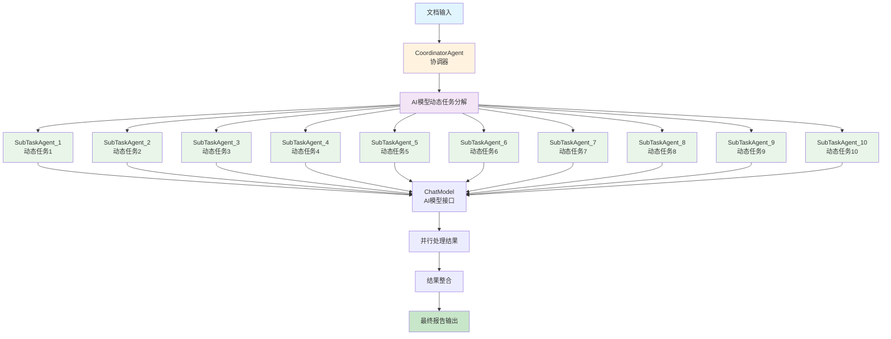

# Agentic Workflow Dynamic Decomposition 动态分解工作流说明文档

## 概述

Agentic Workflow Dynamic Decomposition 是一个基于动态任务分解模式的智能文档处理系统。该系统通过协调器（Coordinator）和子任务代理（SubTask Agents）的协作，使用大型语言模型动态生成专门的子任务，将复杂的文档分析任务智能分解为10个独立的并行子任务，以提高处理效率和分析深度。

### 核心理念

- **动态任务分解**：使用AI模型根据文档内容智能生成最适合的子任务
- **智能并行处理**：10个动态生成的子任务同时执行，最大化处理效率
- **自适应分工**：每个子任务根据文档特点自动调整分析重点
- **结果整合**：将所有动态子任务结果合并为完整的文档分析报告

## 系统架构



## 核心组件

### 1. DynamicDecomposition（主入口）
- **职责**：系统的主入口和流程控制
- **功能**：
  - 读取输入文档文件
  - 初始化协调器代理
  - 保存处理结果到输出文件
  - 管理整体工作流程

### 2. CoordinatorAgent（协调器）
- **职责**：动态任务分解和子代理协调
- **功能**：
  - 使用AI模型根据文档内容动态生成10个专门的子任务
  - 创建并管理多个子任务代理
  - 协调子任务的并行执行
  - 整合所有子任务的处理结果

### 3. SubTaskAgent（子任务代理）
- **职责**：执行动态生成的文档分析子任务
- **功能**：
  - 处理分配的动态生成子任务
  - 调用AI模型进行信息提取
  - 返回结构化的处理结果
  - 支持异步并行执行

## 详细流程说明

### 1. 动态任务分解阶段
协调器使用大型语言模型分析文档内容，智能生成10个最适合的子任务：

**分解策略**：
- 分析文档类型和内容特点
- 生成针对性的实体提取任务
- 确保任务之间相互独立，可并行执行
- 避免需要数学运算的任务（如计数、频率计算）

**典型生成的子任务类型**：
- 人物角色分析和提取
- 地点场景信息提取
- 主题思想识别
- 情节要点梳理
- 对话内容分析
- 描述性语言提取
- 时间线信息整理
- 关键事件识别
- 情感色彩分析
- 文学手法识别

### 2. 并行执行阶段
1. **子代理创建**
   - 为每个动态生成的子任务创建专门的SubTaskAgent实例
   - 每个代理分配唯一的名称和动态任务内容

2. **异步并行处理**
   - 使用asyncio.create_task创建异步任务
   - 10个子任务同时执行，最大化处理效率
   - 使用asyncio.gather等待所有任务完成

3. **AI模型调用**
   - 每个子代理调用ChatModel进行信息提取
   - 使用asyncio.to_thread避免阻塞主线程
   - 处理异常情况并返回错误信息

### 3. 结果整合阶段
1. **收集子任务结果**
   - 等待所有并行任务完成
   - 收集每个子代理的处理结果

2. **生成最终报告**
   - 将所有动态子任务结果合并为完整的文档分析报告
   - 按照任务描述组织输出内容
   - 保存到指定的输出文件

## 文件结构

```
dynamic_decomposition/
├── main.py                  # 主程序入口
├── coordinator.py           # 协调器代理实现
├── delegates.py             # 子任务代理实现
└── README.md                # 本说明文档
```

## 配置和使用

### 环境要求
- Python 3.8+
- Agently 框架
- asyncio 支持
- AI模型API访问权限

### 基本使用

```python
import asyncio
from dynamic_decomposition.main import DynamicDecomposition

async def run_dynamic_decomposition_example():
    """运行动态分解工作流示例"""
    
    # 创建动态分解实例
    dynamic_decomp = DynamicDecomposition()
    
    print("开始执行动态分解工作流...")
    print(f"输入文件：{dynamic_decomp.input_file}")
    print(f"输出文件：{dynamic_decomp.output_file}")
    
    try:
        # 执行动态分解流程
        await dynamic_decomp.run()
        
        print("✅ 动态分解工作流执行完成！")
        print(f"结果已保存到：{dynamic_decomp.output_file}")
        
        # 读取并显示结果摘要
        with open(dynamic_decomp.output_file, 'r', encoding='utf-8') as f:
            content = f.read()
            print(f"生成内容长度：{len(content)} 字符")
            
    except Exception as e:
        print(f"❌ 工作流执行失败：{str(e)}")

if __name__ == "__main__":
    asyncio.run(run_dynamic_decomposition_example())
```

### 自定义配置

```python
# 自定义输入输出文件
class CustomDynamicDecomposition(DynamicDecomposition):
    def __init__(self, input_file: str, output_file: str):
        super().__init__()
        self.input_file = input_file
        self.output_file = output_file

# 使用自定义配置
custom_decomp = CustomDynamicDecomposition("my_document.txt", "my_results.md")
asyncio.run(custom_decomp.run())
```

## 特性和优势

### 1. 智能的动态分解
- AI模型根据文档内容自动生成最适合的分析任务
- 每次处理都能获得针对性的分析维度

### 2. 高效的并行处理
- 10个子任务同时执行，大幅提高处理速度
- 充分利用异步编程模型，避免阻塞等待

### 3. 自适应的任务生成
- 根据不同类型文档生成不同的分析任务
- 避免固定模式的局限性，提高分析的全面性

### 4. 完整的错误处理
- 每个子任务都有独立的错误处理机制
- 单个子任务失败不影响其他任务执行

## 应用场景

- 文学作品和小说分析
- 学术论文和研究报告处理
- 新闻文章和媒体内容分析
- 历史文档和档案研究
- 任何需要深度内容分析的文档处理任务

## 技术细节

### 动态任务分解策略

系统使用AI模型进行智能任务分解：

```python
async def decompose_task(self, book_content: str) -> dict:
    llm_input = f"""
    您是文学分析方面的专家。给定一本书的文本，请生成恰好 10 个可并行执行的独立提取任务。
    这些任务应侧重于提取不同类型的实体，例如人物、地点、主题、情节要点等等。
    输出应是一个 JSON 对象，键为 'task_1'、'task_2' 等等，对应的值为任务描述。
    不要包含需要数学运算的任务，比如计数和频率计算等。

    书籍文本：\n
    {book_content}
    """
    
    json_str = self.agent.input(llm_input).output("输出任务分解结果").start()
    result_dict = json.loads(json_str)
    return result_dict
```

### 异步并行处理机制

使用Python的asyncio库实现高效的并行处理：

```python
# 创建并行任务
tasks = []
for idx, sub_task in enumerate(sub_tasks):
    agent_name = f"SubTaskAgent_{idx + 1}"
    sub_message = Message(
        content={"document": book_content, "task": sub_task},
        sender=self.name,
        recipient=agent_name,
    )
    agent = SubTaskAgent(name=agent_name)
    task = asyncio.create_task(agent.process(sub_message))
    tasks.append(task)

# 并行执行所有子任务
sub_results = await asyncio.gather(*tasks)
```

### 错误处理和日志

系统集成了完善的错误处理和日志记录：

- 使用loguru进行结构化日志记录
- 每个子任务都有独立的异常捕获
- 详细的错误信息便于调试和监控

## 性能优化建议

1. **模型选择**：选择响应速度快且分析能力强的AI模型
2. **任务数量调整**：根据文档复杂度调整子任务数量（默认10个）
3. **缓存机制**：对相似文档的任务分解结果进行缓存
4. **资源限制**：控制并发子任务数量，避免资源过度消耗

## 扩展开发

### 调整子任务数量

```python
async def decompose_task(self, book_content: str, task_count: int = 10) -> dict:
    llm_input = f"""
    您是文学分析方面的专家。给定一本书的文本，请生成恰好 {task_count} 个可并行执行的独立提取任务。
    ...
    """
    # 其余逻辑保持不变
```

### 自定义任务分解提示

```python
def get_decomposition_prompt(self, content_type: str = "文学作品") -> str:
    prompts = {
        "文学作品": "您是文学分析方面的专家...",
        "学术论文": "您是学术研究方面的专家...",
        "新闻报道": "您是新闻分析方面的专家...",
    }
    return prompts.get(content_type, prompts["文学作品"])
```

### 自定义结果整合策略

```python
def combine_results(self, sub_results: list, sub_tasks: dict) -> str:
    document = "# 动态文档分析报告\n\n"
    document += f"本次分析共生成 {len(sub_tasks)} 个动态子任务\n\n"
    
    for idx, (key, task_description) in enumerate(sub_tasks.items()):
        result = sub_results[idx]
        document += f"## 任务 {idx + 1}: {task_description}\n\n"
        document += f"{result.content}\n\n"
        document += "---\n\n"
    
    return document
```

## 与固定分解模式的对比

| 特性 | 动态分解 | 固定分解 |
|------|----------|----------|
| 任务生成 | AI智能生成 | 预定义固定任务 |
| 适应性 | 根据内容自适应 | 固定分析维度 |
| 任务数量 | 10个动态任务 | 5个固定任务 |
| 分析深度 | 更深入、更全面 | 标准化分析 |
| 处理速度 | 稍慢（需生成任务） | 更快（直接执行） |
| 适用场景 | 复杂文档分析 | 标准化处理 |

## 常见问题

### Q: 如何修改动态生成的子任务数量？
A: 修改`CoordinatorAgent`类中的`decompose_task`方法，调整提示中的任务数量要求。

### Q: 如何处理任务分解失败的情况？
A: 系统已内置错误处理，分解失败时会返回空字典，可以添加备用的固定任务作为降级方案。

### Q: 如何针对不同类型文档优化分解策略？
A: 可以根据文档类型调整分解提示，或者预先分类文档类型后使用不同的分解策略。

### Q: 动态分解的性能如何？
A: 相比固定分解，动态分解需要额外的AI调用来生成任务，但能获得更精准的分析结果，适合对分析质量要求较高的场景。