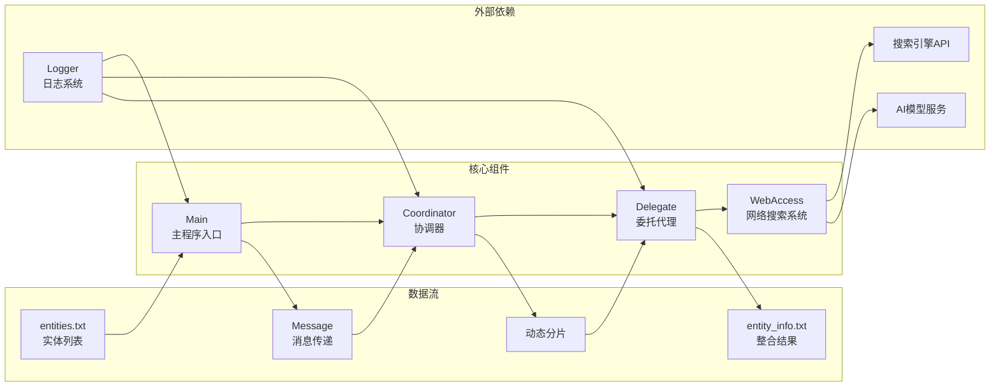

# Dynamic Sharding 动态分片智能信息处理工作流说明文档

## 概述

Dynamic Sharding 是一个基于智能代理的动态分片信息处理工作流系统。该系统通过协调器（Coordinator）和委托代理（Delegate）的协作，实现对大量实体数据的分片处理、并发信息获取和结果整合的完整流程。系统集成了Web Access智能网络搜索功能，能够自动获取实体的详细信息并生成结构化报告。

### 核心理念

- **动态分片处理**：根据配置的分片大小自动将大量实体分割为小批次处理
- **智能代理协作**：协调器负责任务分配，委托代理专注于信息获取
- **异步并发优化**：使用asyncio实现高效的异步并发处理
- **智能信息获取**：集成Web Access系统，自动搜索、抓取和摘要实体信息

## 系统架构



## 核心组件

### 1. Main（主程序入口）
- **职责**：系统初始化和流程控制
- **功能**：
  - 读取输入实体文件
  - 创建消息对象并传递给协调器
  - 处理协调器响应并保存结果
  - 统一的异常处理和日志记录

### 2. Coordinator（协调器）
- **职责**：任务分片和子代理管理
- **功能**：
  - 根据分片大小对实体列表进行动态分片
  - 为每个分片创建独立的委托代理
  - 管理异步任务的并发执行
  - 收集和整合所有分片的处理结果

### 3. Delegate（委托代理）
- **职责**：单个分片的信息获取处理
- **功能**：
  - 处理分配的实体分片
  - 为每个实体异步获取详细信息
  - 调用WebAccess系统进行智能搜索
  - 返回格式化的实体信息

### 4. Message（消息传递）
- **职责**：系统内部通信的数据结构
- **功能**：
  - 封装消息内容、发送者和接收者信息
  - 支持可选的元数据传递
  - 提供标准化的消息格式

### 5. WebAccess集成
- **职责**：智能网络信息获取
- **功能**：
  - 自动搜索实体相关信息
  - 网页内容抓取和处理
  - AI驱动的内容摘要生成
  - 结构化信息输出

## 详细流程说明

### 第一阶段：数据输入和初始化
1. **文件读取**
   - 从entities.txt读取实体列表
   - 每行一个实体，自动去除空白字符
   - 创建包含实体和分片大小的消息对象

2. **系统初始化**
   - 创建协调器实例
   - 设置日志记录系统
   - 准备异步执行环境

### 第二阶段：动态分片处理
1. **智能分片**
   - 根据配置的shard_size对实体列表进行分片
   - 动态计算分片数量：`len(entities) / shard_size`
   - 确保最后一个分片包含剩余的所有实体

2. **代理创建**
   - 为每个分片创建独立的Delegate实例
   - 使用唯一命名：`ShardProcessingAgent_{idx}`
   - 创建异步任务进行并发处理

### 第三阶段：并发信息获取
1. **异步处理**
   - 使用asyncio.gather()并发执行所有分片任务
   - 每个委托代理独立处理分配的实体
   - 为每个实体调用WebAccess获取详细信息

2. **信息整合**
   - 收集所有分片的处理结果
   - 按顺序整合信息内容
   - 生成最终的结构化报告

### 第四阶段：结果输出
1. **数据保存**
   - 将整合后的信息写入entity_info.txt
   - 使用UTF-8编码确保中文字符正确显示
   - 记录处理完成的日志信息

## 文件结构

```
dynamic_sharding/
├── main.py              # 主程序入口和流程控制
├── coordinator.py       # 协调器，负责分片和任务分配
├── delegate.py          # 委托代理，负责信息获取
├── message.py           # 消息传递的数据结构
├── data/                # 数据存储目录
│   ├── entities.txt     # 输入实体列表文件
│   └── entity_info.txt  # 输出信息整合文件
└── __pycache__/         # Python缓存文件
```

## 配置和使用

### 环境要求
- Python 3.8+
- asyncio 异步编程支持
- Web Access 系统依赖
- 日志系统（loguru）
- 网络搜索API密钥

### 基本使用

```python
import asyncio
from dynamic_sharding.main import run

# 执行完整的动态分片处理流程
input_file = "dynamic_sharding/data/entities.txt"
output_file = "dynamic_sharding/data/entity_info.txt"
shard_size = 3  # 每个分片包含3个实体

asyncio.run(run(input_file, output_file, shard_size))
```

### 自定义配置

```python
# 调整分片大小
shard_size = 5  # 更大的分片，减少并发数量

# 自定义文件路径
input_file = "custom/entities.txt"
output_file = "custom/results.txt"

# 执行处理
asyncio.run(run(input_file, output_file, shard_size))
```

### 单独使用组件

```python
# 直接使用协调器
from dynamic_sharding.coordinator import Coordinator
from dynamic_sharding.message import Message

coordinator = Coordinator("TestCoordinator")
message = Message(
    content={'entities': ['孔子', '李白'], 'shard_size': 2},
    sender="User",
    recipient="Coordinator"
)
response = await coordinator.run(message)

# 直接使用委托代理
from dynamic_sharding.delegate import Delegate

delegate = Delegate("TestDelegate")
message = Message(
    content=['苏轼', '王阳明'],
    sender="Coordinator",
    recipient="User"
)
response = await delegate.process(message)
```

## 特性和优势

### 1. 动态分片机制
- 根据数据量自动调整处理策略
- 支持灵活的分片大小配置
- 确保系统资源的合理利用

### 2. 异步并发处理
- 使用asyncio实现高效并发
- 多个分片同时处理，显著提升效率
- 智能任务调度和资源管理

### 3. 智能信息获取
- 集成Web Access智能搜索系统
- AI驱动的内容理解和摘要
- 自动化的信息质量控制

### 4. 容错和恢复机制
- 完善的异常处理机制
- 单个实体处理失败不影响整体流程
- 详细的错误日志和状态跟踪

### 5. 可扩展架构
- 模块化设计，易于扩展和维护
- 标准化的消息传递接口
- 支持自定义处理逻辑

## 应用场景

- **批量人物信息收集**：历史人物、名人、专家等信息整理
- **企业信息调研**：公司、品牌、产品等商业信息收集
- **学术研究支持**：文献作者、研究机构等学术信息获取
- **市场分析**：竞品、行业领袖等市场信息整合
- **知识图谱构建**：实体信息的批量获取和结构化处理

## 技术细节

### 异步编程模式

系统采用现代Python异步编程：

```python
# 并发任务创建
tasks = []
for idx, shard in enumerate(shards):
    task = asyncio.create_task(agent.process(message))
    tasks.append(task)

# 等待所有任务完成
sub_responses = await asyncio.gather(*tasks)
```

### 消息传递机制

标准化的消息格式确保组件间通信：

```python
class Message:
    def __init__(self, content, sender, recipient, metadata=None):
        self.content = content      # 消息内容
        self.sender = sender        # 发送者
        self.recipient = recipient  # 接收者
        self.metadata = metadata    # 元数据
```

### 错误处理策略

多层次的错误处理确保系统稳定性：

```python
try:
    # 核心处理逻辑
    result = await process_entity(entity)
except Exception as e:
    logger.error(f"处理实体 {entity} 时出错: {e}")
    return f"获取 {entity} 的信息时出错。"
```

## 性能优化建议

1. **分片大小调优**：根据系统资源和网络条件调整shard_size
2. **并发控制**：避免过多并发请求导致API限制
3. **缓存机制**：为重复查询的实体添加缓存
4. **批量处理**：支持多文件批量处理模式

## 扩展开发

### 添加新的信息源

```python
class CustomInfoProvider:
    """自定义信息提供者"""
    async def get_entity_info(self, entity: str) -> str:
        # 自定义信息获取逻辑
        pass
```

### 自定义分片策略

```python
class CustomShardingStrategy:
    """自定义分片策略"""
    def create_shards(self, entities: List[str], config: dict) -> List[List[str]]:
        # 自定义分片逻辑
        pass
```

## 常见问题

### Q: 如何调整分片大小？
A: 修改main.py中的shard_size参数，建议根据系统性能和API限制进行调整。

### Q: 如何处理网络超时？
A: 系统已集成WebAccess的超时处理机制，可以通过修改WebAccess配置调整超时时间。

### Q: 如何添加新的实体类型？
A: 只需在entities.txt中添加新实体，系统会自动处理不同类型的实体。

### Q: 如何自定义输出格式？
A: 修改delegate.py中的fetch_entity_info方法，调整返回的信息格式。
