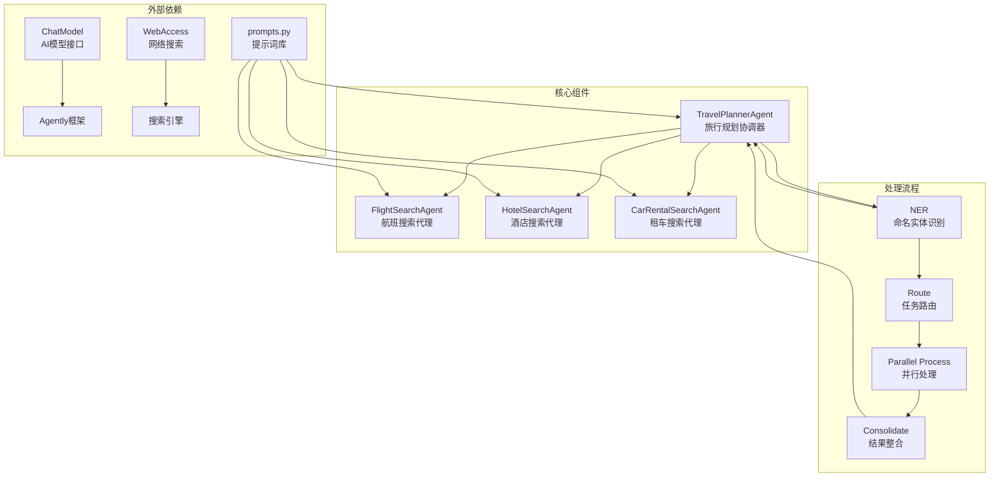

# Agentic Workflow Parallel Delegation 工作流说明文档

## 概述

Agentic Workflow Parallel Delegation 是一个基于并行委托模式的智能旅行规划系统。该系统通过协调器（Coordinator）和专业子代理（Sub-agents）的协作，实现复杂查询的分解、并行处理和结果整合，为用户提供全面的旅行规划服务。

### 核心理念

- **并行处理**：将复杂查询分解为多个子任务并行执行，提高效率
- **专业分工**：每个子代理专注于特定领域（航班、酒店、租车），提供专业服务
- **实体识别**：通过命名实体识别（NER）技术，精准提取用户意图和关键信息
- **结果整合**：将多个子代理的结果智能整合，生成连贯一致的回复

## 系统架构



## 核心组件

### 1. TravelPlannerAgent（旅行规划协调器）
- **职责**：协调整个工作流的执行
- **功能**：
  - 执行命名实体识别（NER），提取用户意图和实体
  - 根据识别结果路由任务到专业子代理
  - 并行处理多个子任务
  - 整合子代理结果，生成最终回复

### 2. FlightSearchAgent（航班搜索代理）
- **职责**：处理航班相关查询
- **功能**：
  - 优化用户航班查询为有效的搜索语句
  - 执行网络搜索获取航班信息
  - 返回结构化的航班搜索结果

### 3. HotelSearchAgent（酒店搜索代理）
- **职责**：处理酒店相关查询
- **功能**：
  - 优化用户酒店查询为有效的搜索语句
  - 执行网络搜索获取酒店信息
  - 返回结构化的酒店搜索结果

### 4. CarRentalSearchAgent（租车搜索代理）
- **职责**：处理租车相关查询
- **功能**：
  - 优化用户租车查询为有效的搜索语句
  - 执行网络搜索获取租车信息
  - 返回结构化的租车搜索结果

## 详细流程说明

### 1. 命名实体识别（NER）
1. **接收用户查询**
   - 使用 `NER_SYSTEM` 和 `NER_USER` 提示词
   - 分析用户查询，识别多种旅行相关意图
   - 提取关键实体（如出发地、目的地、日期、人数等）

2. **实体分类**
   - 将提取的实体按类别（航班、酒店、租车）分组
   - 构建结构化的实体字典，便于后续处理

### 2. 任务路由与并行处理
1. **路由到专业子代理**
   - 根据识别的实体类型，将任务分配给对应的子代理
   - 创建异步任务，准备并行执行

2. **子代理处理**
   - 每个子代理接收特定领域的查询
   - 优化查询为有效的网络搜索语句
   - 执行网络搜索，获取相关信息
   - 返回处理结果

### 3. 结果整合
1. **收集子代理响应**
   - 等待所有并行任务完成
   - 收集各子代理的处理结果

2. **生成综合回复**
   - 使用 `COORDINATOR_SYSTEM` 和 `COORDINATOR_USER` 提示词
   - 整合所有子代理的结果
   - 生成连贯、全面的最终回复

## 文件结构

```
parallel_delegation/
├── main.py                  # 主程序入口
├── coordinator.py           # 旅行规划协调器实现
├── flight_search.py         # 航班搜索代理实现
├── hotel_search.py          # 酒店搜索代理实现
├── car_rental_search.py     # 租车搜索代理实现
├── prompts.py               # 提示词定义
└── README.md                # 本说明文档
```

## 配置和使用

### 环境要求
- Python 3.8+
- Agently 框架
- asyncio 支持
- 网络访问权限

### 基本使用

```python
import asyncio
from parallel_delegation.main import main

# 定义用户查询
user_query = "我需要从北京飞到上海，3月15日出发，2个人，还要在上海订一个有游泳池和健身房的酒店住3晚，另外需要租一辆SUV，在浦东机场取车，3天后在虹桥机场还车"

# 执行旅行规划
asyncio.run(main(user_query))
```

### 自定义配置

```python
# 自定义子代理
from parallel_delegation.coordinator import TravelPlannerAgent
from parallel_delegation.flight_search import FlightSearchAgent
from parallel_delegation.hotel_search import HotelSearchAgent

# 只使用航班和酒店代理
flight_agent = FlightSearchAgent(name="FlightSearchAgent")
hotel_agent = HotelSearchAgent(name="HotelSearchAgent")

# 初始化旅行规划代理
travel_planner = TravelPlannerAgent(
    name="TravelPlannerAgent",
    sub_agents=[flight_agent, hotel_agent]
)
```

## 特性和优势

### 1. 并行处理机制
- 同时处理多个子任务，大幅提高响应速度
- 充分利用异步编程模型，避免阻塞等待

### 2. 精准的实体识别
- 使用命名实体识别技术，准确提取用户意图
- 支持多意图识别，处理复杂的混合查询

### 3. 专业的领域处理
- 每个子代理专注于特定领域，提供专业服务
- 针对不同领域使用优化的提示词和处理逻辑

### 4. 智能结果整合
- 将多个子代理的结果智能整合
- 生成连贯、全面的最终回复

## 应用场景

- 旅行规划和预订服务
- 多领域混合查询处理
- 复杂信息检索和整合
- 任何需要并行处理和结果整合的任务

## 技术细节

### 提示词设计原则

系统采用了精心设计的提示词体系：

1. **角色定位**：将AI定位为专业的旅行规划助手和领域专家
2. **任务明确**：清晰定义每个代理的职责和处理范围
3. **结构化输出**：规定输出格式，便于后续处理
4. **示例引导**：通过具体示例指导AI优化查询

### 异步并行处理机制

系统使用Python的asyncio库实现并行处理：

```python
async def route_to_agent(self, entities: dict):
    tasks = []
    for entity_type, entity_values in entities['entities'].items():
        agent = self.get_agent_for_entity(entity_type)
        if agent:
            task = asyncio.create_task(self.process_entity(agent, entity_type, entity_values))
            tasks.append(task)
    return await asyncio.gather(*tasks)
```

### 错误处理和日志

系统集成了完善的错误处理和日志记录：

- 使用loguru进行结构化日志记录
- 每个关键操作都有异常捕获
- 详细的错误信息便于调试

## 性能优化建议

1. **缓存机制**：对常见查询结果进行缓存，避免重复搜索
2. **批量处理**：对于大量用户查询，可以考虑批量处理模式
3. **超时控制**：为网络搜索添加超时机制，避免长时间等待
4. **负载均衡**：在高并发场景下，考虑添加负载均衡机制

## 扩展开发

### 添加新的子代理

```python
class RestaurantSearchAgent:
    """新增餐厅搜索代理"""
    def __init__(self, name: str):
        self.name = name
        agent_factory = ChatModel().get_agent_factory()
        self.agent = agent_factory.create_agent()

    async def process(self, message: Message) -> Message:
        # 餐厅搜索逻辑
        pass
```

### 自定义提示词

在`prompts.py`中添加新的提示词模板：

```python
RESTAURANT_SYSTEM = """
你是一名餐厅搜索助手——你的主要职责是解读用户与餐厅预订及偏好相关的查询...
"""

RESTAURANT_USER = """
用户提供的查询：`{query}`
"""
```

### 扩展实体识别

修改`perform_ner`方法以支持新的实体类型：

```python
"RESTAURANT": {
    "cuisine_type": ("str", "餐厅菜系类型，未指定返回'NA'"),
    "price_range": ("str", "价格范围，未指定返回'NA'"),
    "location": ("str", "餐厅位置，未指定返回'NA'"),
    "reservation_time": ("str", "预订时间，未指定返回'NA'"),
    "party_size": ("str", "就餐人数，未指定返回'NA'")
}
```

## 常见问题

### Q: 如何添加新的子代理？
A: 创建新的子代理类，实现`process`方法，并在初始化`TravelPlannerAgent`时添加到`sub_agents`列表中。

### Q: 如何处理复杂的多意图查询？
A: 系统已设计为支持多意图识别和并行处理，无需特殊处理。

### Q: 如何提高网络搜索的准确性？
A: 可以优化`prompts.py`中的提示词，或改进`WebAccess`类的搜索逻辑。

### Q: 如何处理搜索超时问题？
A: 在`WebAccess`类中添加超时控制，并在子代理中添加相应的错误处理逻辑。