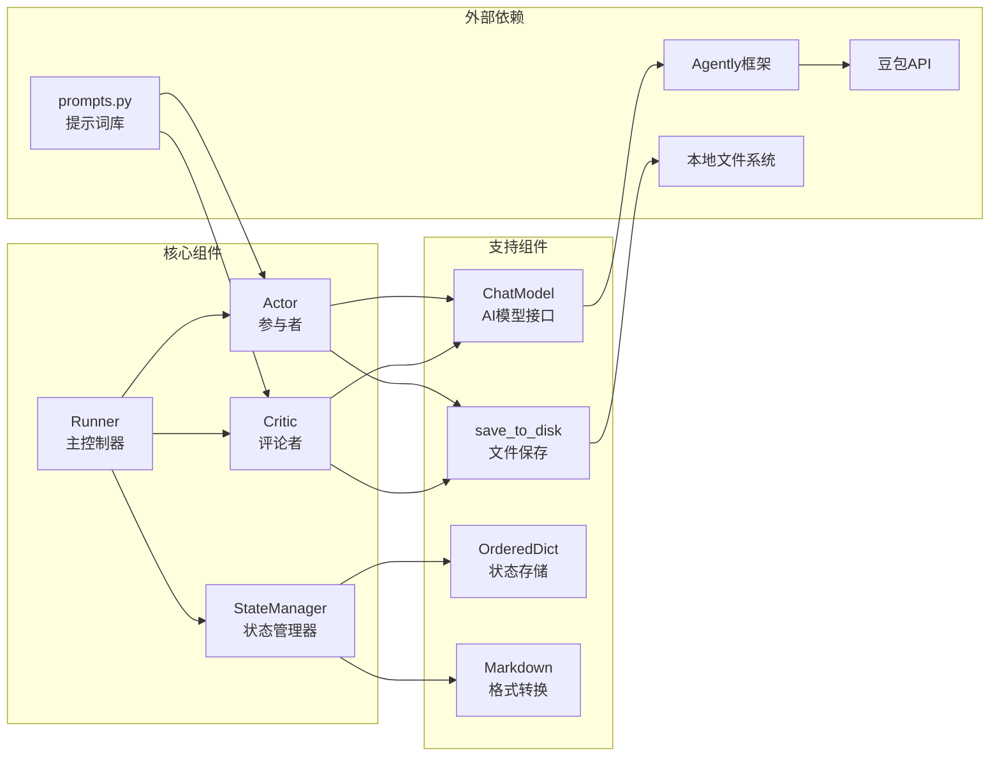

# Agentic Workflow Reflection 工作流说明文档

## 概述

Agentic Workflow Reflection 是一个基于 Actor-Critic 模式的智能反思工作流系统。该系统通过参与者（Actor）和评论者（Critic）的协作循环，实现内容的持续改进和优化。

### 核心理念

- **反思驱动**：通过多轮反馈和修订，不断提升内容质量
- **角色分离**：Actor 专注创作，Critic 专注评审，职责明确
- **状态管理**：完整记录工作流历史，支持追溯和分析
- **可配置性**：支持自定义循环次数和主题内容

## 系统架构



## 核心组件

### 1. Runner（主控制器）
- **职责**：协调整个工作流的执行
- **功能**：
  - 管理循环次数和主题
  - 控制 Actor 和 Critic 的交互
  - 维护工作流状态
  - 输出最终结果

### 2. Actor（参与者）
- **职责**：内容生成和修订
- **功能**：
  - 生成指定主题的初始草稿
  - 根据评审反馈修订内容
  - 保存生成的内容到本地

### 3. Critic（评论者）
- **职责**：内容评审和反馈
- **功能**：
  - 对草稿进行专业评审
  - 提供建设性的改进建议
  - 根据修订情况更新评审意见

### 4. StateManager（状态管理器）
- **职责**：维护工作流状态
- **功能**：
  - 有序存储所有交互历史
  - 转换状态为 Markdown 格式
  - 支持状态查询和追溯

## 详细流程说明

### 第一轮循环（初始化）
1. **Actor 生成初稿**
   - 使用 `ACTOR_DRAFT_SYSTEM` 和 `ACTOR_DRAFT_USER` 提示词
   - 基于指定主题生成 1200-1600 字的学术文章
   - 保存为 `data/draft/v0.json`

2. **Critic 评审初稿**
   - 使用 `CRITIC_REVIEW_SYSTEM` 和 `CRITIC_REVIEW_USER` 提示词
   - 提供专业的同行评议
   - 保存为 `data/feedback/v0.json`

### 后续循环（修订）
1. **Actor 修订草稿**
   - 基于完整的历史状态（包括之前的草稿和评审）
   - 使用 `ACTOR_REVISE_SYSTEM` 和 `ACTOR_REVISE_USER` 提示词
   - 系统性地处理所有反馈意见

2. **Critic 修订评审**
   - 检查修订后的草稿
   - 关注新问题或改进空间
   - 避免重复已解决的问题

## 文件结构

```
reflection/
├── main.py              # 主程序入口
├── actor.py             # Actor类实现
├── critic.py            # Critic类实现
├── prompts.py           # 提示词定义
├── data/                # 数据存储目录
│   ├── draft/           # 草稿文件
│   │   ├── v0.json      # 初始草稿
│   │   ├── v1.json      # 第一次修订
│   │   └── ...
│   └── feedback/        # 评审文件
│       ├── v0.json      # 初始评审
│       ├── v1.json      # 第一次修订评审
│       └── ...
└── README.md            # 本说明文档
```

## 配置和使用

### 环境要求
- Python 3.8+
- Agently 框架
- 豆包 API 密钥

### 基本使用

```python
from main import Runner

# 创建工作流实例
topic = "大模型 MCP"
num_cycles = 3
runner = Runner(topic, num_cycles)

# 执行工作流
final_result = runner.run()
print(final_result)
```

### 自定义配置

```python
# 修改循环次数
runner = Runner("你的主题", 5)  # 执行5轮循环

# 查看中间状态
state_manager = runner.state_manager
current_state = state_manager.get_state()
markdown_output = state_manager.to_markdown()
```

## 特性和优势

### 1. 智能反思机制
- 通过多轮迭代不断改进内容质量
- Actor 和 Critic 角色分离，确保客观评审

### 2. 完整状态追溯
- 记录每一轮的草稿和评审
- 支持 Markdown 格式输出，便于查看

### 3. 灵活的提示词系统
- 专业的学术写作提示词
- 结构化的评审标准
- 支持自定义修改

### 4. 可扩展架构
- 模块化设计，易于扩展
- 支持不同的 AI 模型
- 可配置的存储方式

## 应用场景

- 学术论文写作和改进
- 技术文档的迭代优化
- 创意内容的反思式创作
- 任何需要多轮反馈改进的文本生成任务

## 技术细节

### 提示词设计原则

系统采用了精心设计的提示词体系：

1. **角色定位**：将 AI 定位为"享誉全球的知名高校杰出教授"
2. **任务明确**：清晰定义写作和评审的具体要求
3. **结构化输出**：规定文章结构和评审格式
4. **质量控制**：设置字数要求和技术深度标准

### 状态管理机制

StateManager 使用 OrderedDict 确保状态的有序性：

```python
# 状态添加示例
state_manager.add_entry("initial_draft V0", draft_content)
state_manager.add_entry("initial_review", review_content)

# Markdown 转换
markdown_output = state_manager.to_markdown()
```

### 错误处理和日志

系统集成了完善的错误处理和日志记录：

- 使用 loguru 进行结构化日志记录
- 每个关键操作都有异常捕获
- 详细的错误信息便于调试

## 性能优化建议

1. **批量处理**：对于大量文档，可以考虑批量处理模式
2. **缓存机制**：可以添加中间结果缓存，避免重复计算
3. **并行处理**：Actor 和 Critic 的某些操作可以并行执行
4. **模型选择**：根据需求选择合适的 AI 模型

## 扩展开发

### 添加新的角色

```python
class Reviewer:
    """新增审查者角色"""
    def __init__(self):
        # 初始化代码
        pass

    def final_review(self, content):
        # 最终审查逻辑
        pass
```

### 自定义提示词

在 `prompts.py` 中添加新的提示词模板：

```python
CUSTOM_SYSTEM_PROMPT = """
你的自定义系统提示词...
"""
```

### 集成其他 AI 模型

修改 `ChatModel` 类以支持其他 AI 服务：

```python
def get_agent_factory(self, model_source="openai"):
    if model_source == "openai":
        # OpenAI 配置
        pass
    elif model_source == "claude":
        # Claude 配置
        pass
```

## 常见问题

### Q: 如何调整循环次数？
A: 在创建 Runner 实例时指定 `num_cycles` 参数。

### Q: 如何查看中间结果？
A: 可以通过 StateManager 的 `to_markdown()` 方法查看完整历史。

### Q: 如何自定义主题？
A: 在创建 Runner 时传入自定义的 `topic` 参数。

### Q: 如何处理 API 限制？
A: 可以在 ChatModel 中添加重试机制和速率限制。

---

*本文档描述了 Agentic Workflow Reflection 系统的完整架构和使用方法。如有疑问，请参考源代码或联系开发者。*
