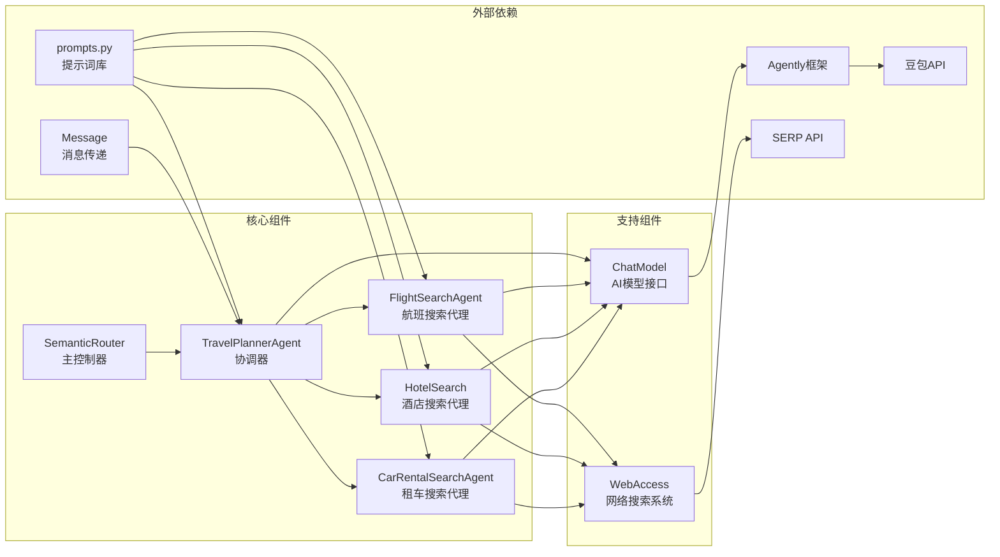

# Semantic Router 智能语义路由工作流说明文档

## 概述

Semantic Router 是一个基于智能代理的语义路由工作流系统。该系统通过协调器-委托代理模式，实现用户查询的智能意图识别和精准路由。核心思想是使用主协调器（TravelPlannerAgent）分析用户意图，然后将查询路由到最合适的专业代理进行处理，而不是同时激活多个代理。

### 核心理念

- **语义意图分析**：使用大语言模型深度理解用户查询意图
- **精准路由机制**：基于意图分析结果，选择最合适的专业代理
- **专业化处理**：每个子代理专注于特定领域的查询处理
- **查询重构优化**：子代理将原始查询重构为搜索优化格式
- **集成网络搜索**：所有子代理都集成了Web Access管道，获取实时信息

## 系统架构



## 核心组件

### 1. SemanticRouter（主控制器）
- **职责**：协调整个语义路由工作流的执行
- **功能**：
  - 初始化所有专业代理
  - 管理代理间的消息传递
  - 统一异常处理和日志记录
  - 提供简洁的查询接口

### 2. TravelPlannerAgent（协调器）
- **职责**：用户意图分析和查询路由
- **功能**：
  - 使用AI模型进行语义意图分析
  - 将查询分类为FLIGHT、HOTEL、CAR_RENTAL或UNKNOWN
  - 路由查询到相应的专业代理
  - 整合子代理响应并格式化最终结果
  - 管理与子代理的通信

### 3. FlightSearchAgent（航班搜索代理）
- **职责**：处理航班相关查询
- **功能**：
  - 分析航班搜索需求
  - 将查询重构为优化的搜索参数
  - 集成WebAccess获取实时航班信息
  - 返回格式化的航班搜索结果

### 4. HotelSearch（酒店搜索代理）
- **职责**：处理酒店预订查询
- **功能**：
  - 分析住宿需求和偏好
  - 优化酒店搜索关键词
  - 通过WebAccess获取酒店信息
  - 提供相关酒店推荐和详情

### 5. CarRentalSearchAgent（租车搜索代理）
- **职责**：处理汽车租赁查询
- **功能**：
  - 分析租车需求
  - 生成优化的租车搜索查询
  - 集成WebAccess获取租车信息
  - 返回租车选项和详细信息

### 6. Message（消息传递系统）
- **职责**：代理间的标准化通信
- **功能**：
  - 封装查询内容和元数据
  - 管理发送者和接收者信息
  - 支持结构化消息传递

## 详细流程说明

### 第一阶段：查询接收
1. **用户输入**
   - 用户提交旅行相关查询
   - SemanticRouter创建Message对象
   - 查询转发给TravelPlannerAgent

### 第二阶段：意图识别
1. **语义分析**
   - 使用 `COORDINATOR_SYSTEM` 和 `COORDINATOR_USER` 提示词
   - AI模型分析查询的语义意图
   - 确定具体的旅行需求类型

2. **路由决策**
   - 基于意图分析结果进行分类
   - 选择最合适的专业代理
   - 将查询路由到目标代理

### 第三阶段：专业处理
1. **查询重构**
   - 专业代理接收原始查询
   - 使用专门的提示词重构查询
   - 生成搜索优化的关键词

2. **信息获取**
   - 调用WebAccess系统执行网络搜索
   - 抓取相关网页内容
   - 生成结构化摘要信息

### 第四阶段：响应整合
1. **结果处理**
   - TravelPlannerAgent接收子代理响应
   - 整合和格式化信息
   - 生成用户友好的最终回复

2. **输出返回**
   - 返回完整的处理结果
   - 记录查询和响应日志
   - 完成工作流执行

## 文件结构

```
semantic_router/
├── main.py              # 主程序入口和SemanticRouter类
├── coordinator.py       # TravelPlannerAgent协调器
├── flight_search.py     # FlightSearchAgent航班搜索代理
├── hotel_search.py      # HotelSearch酒店搜索代理
├── car_rental_search.py # CarRentalSearchAgent租车搜索代理
├── prompts.py           # 提示词定义
├── README.md            # 本说明文档
└── __pycache__/         # Python缓存文件
```

## 配置和使用

### 环境要求
- Python 3.8+
- Agently 框架
- 豆包 API 密钥
- SERP API 密钥
- Web Access 工作流系统

### 基本使用

```python
from semantic_router.main import SemanticRouter

# 创建语义路由实例
router = SemanticRouter()

# 执行单个查询
query = "你能推荐几家武汉汉阳的酒店我下周入住吗？"
result = router.run(query)
print(result)

# 执行多个查询
queries = [
    "帮我查找从北京到上海的航班",
    "推荐三亚的五星级酒店",
    "我需要在广州租一辆SUV"
]
for query in queries:
    result = router.run(query)
    print(f"查询: {query}")
    print(f"结果: {result}")
    print("-" * 50)
```

### 单独使用各代理

```python
# 直接使用航班搜索代理
from semantic_router.flight_search import FlightSearchAgent
from utils.message import Message

flight_agent = FlightSearchAgent(name='FlightSearchAgent')
message = Message(content="北京到上海的航班", sender="User", recipient="FlightSearchAgent")
response = flight_agent.process(message)

# 直接使用酒店搜索代理
from semantic_router.hotel_search import HotelSearch

hotel_agent = HotelSearch(name='HotelSearchAgent')
message = Message(content="上海外滩附近的酒店", sender="User", recipient="HotelSearchAgent")
response = hotel_agent.process(message)
```

## 特性和优势

### 1. 智能意图识别
- 使用先进的语言模型进行语义理解
- 准确识别用户的真实意图
- 支持复杂和模糊查询的处理

### 2. 精准路由机制
- 基于意图分析的精确路由
- 避免多代理同时激活的资源浪费
- 确保查询由最合适的专家处理

### 3. 专业化处理能力
- 每个代理专注于特定领域
- 针对性的查询优化和处理
- 领域专业知识的深度应用

### 4. 实时信息获取
- 集成Web Access网络搜索系统
- 获取最新的实时信息
- 结构化的信息摘要和整理

### 5. 统一消息传递
- 标准化的代理间通信协议
- 清晰的消息流转和追踪
- 便于调试和监控

## 应用场景

- **旅行规划助手**：综合的旅行查询和规划服务
- **智能客服系统**：旅游行业的自动化客户服务
- **信息聚合平台**：多源旅行信息的智能整合
- **个性化推荐**：基于用户需求的精准推荐服务

## 意图分类体系

系统支持以下意图类型：

### FLIGHT（航班类）
- 航班查询和预订
- 机票价格比较
- 航班时刻表查询
- 航空公司信息

### HOTEL（酒店类）
- 酒店搜索和预订
- 住宿推荐
- 酒店设施查询
- 价格比较

### CAR_RENTAL（租车类）
- 汽车租赁服务
- 车型选择和比较
- 租车条件查询
- 价格和优惠信息

### UNKNOWN（未知类）
- 无法明确分类的查询
- 通用旅行咨询
- 系统功能说明

## 技术细节

### 提示词设计原则

系统采用了分层的提示词体系：

1. **协调器提示词**：专注于意图识别和路由决策
2. **专业代理提示词**：针对特定领域的查询处理
3. **查询重构提示词**：优化搜索关键词生成
4. **统一输出格式**：确保响应的一致性和可用性

### 消息传递机制

使用Message类实现标准化通信：

```python
class Message:
    def __init__(self, content: str, sender: str, recipient: str):
        self.content = content
        self.sender = sender
        self.recipient = recipient
        self.timestamp = datetime.now()
```

### 异常处理策略

- 完整的异常捕获和日志记录
- 优雅的错误降级处理
- 用户友好的错误信息反馈

## 扩展和定制

### 添加新的专业代理

```python
class NewSpecializedAgent(BaseAgent):
    def __init__(self, name: str):
        super().__init__(name)
        
    def process(self, message: Message) -> Message:
        # 实现专业处理逻辑
        pass

# 在SemanticRouter中注册新代理
def __init__(self):
    # ... 现有代理初始化
    self.new_agent = NewSpecializedAgent(name='NewAgent')
    
    self.travel_planner = TravelPlannerAgent(
        name='TravelPlannerAgent',
        sub_agents=[
            self.flight_search, 
            self.hotel_search, 
            self.car_rental_search,
            self.new_agent  # 添加新代理
        ]
    )
```

### 自定义意图分类

修改协调器的提示词以支持新的意图类型：

```python
COORDINATOR_SYSTEM = """
你是一个智能旅行规划助手...
支持的意图类型：
- FLIGHT: 航班相关查询
- HOTEL: 酒店相关查询  
- CAR_RENTAL: 租车相关查询
- NEW_INTENT: 新增意图类型
- UNKNOWN: 未知查询
"""
```

## 性能优化

### 1. 缓存机制
- 实现查询结果缓存
- 减少重复的网络搜索
- 提升响应速度

### 2. 并发处理
- 支持多查询并发处理
- 异步代理通信
- 资源池管理

### 3. 负载均衡
- 代理负载监控
- 智能任务分配
- 系统资源优化

## 常见问题

### Q: 如何处理意图识别错误？
A: 系统会将无法明确分类的查询标记为UNKNOWN，并提供通用的处理方式。可以通过优化提示词和增加训练样本来提高准确率。

### Q: 如何添加新的旅行服务类型？
A: 创建新的专业代理类，实现相应的处理逻辑，然后在TravelPlannerAgent中注册该代理即可。

### Q: 如何自定义响应格式？
A: 修改各代理的提示词中的输出格式要求，或在协调器中添加后处理逻辑。

### Q: 如何提高路由准确性？
A: 可以通过优化意图识别的提示词、增加更多的示例样本、或使用更强大的语言模型来提升准确性。

### Q: 系统如何处理多意图查询？
A: 当前版本专注于单一意图识别，对于多意图查询，协调器会选择最主要的意图进行处理。未来版本可以支持多意图并行处理。