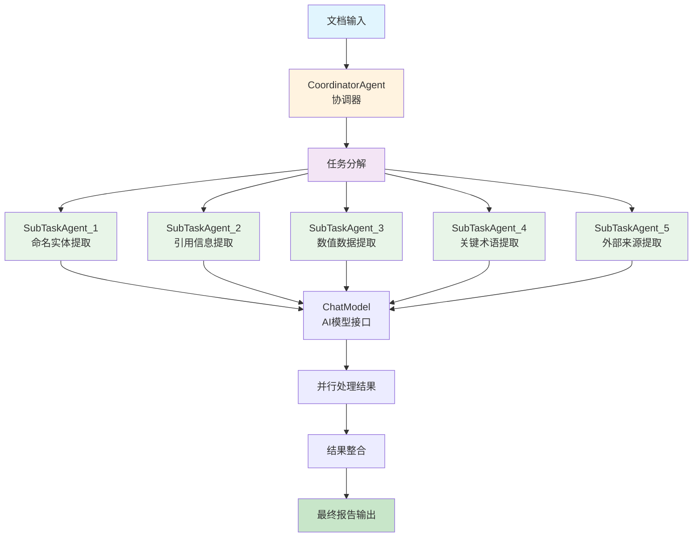

# Agentic Workflow Task Decomposition 工作流说明文档

## 概述

Agentic Workflow Task Decomposition 是一个基于任务分解模式的智能文档处理系统。该系统通过协调器（Coordinator）和子任务代理（SubTask Agents）的协作，将复杂的文档分析任务分解为多个专门的子任务，并行执行以提高处理效率和准确性。

### 核心理念

- **任务分解**：将复杂的文档分析任务分解为多个专门的子任务
- **并行处理**：多个子任务代理同时执行，提高处理效率
- **专业分工**：每个子任务专注于特定的信息提取领域
- **结果整合**：将所有子任务结果合并为完整的文档分析报告

## 系统架构



## 核心组件

### 1. TaskDecomposition（主入口）
- **职责**：系统的主入口和流程控制
- **功能**：
  - 读取输入文档文件
  - 初始化协调器代理
  - 保存处理结果到输出文件
  - 管理整体工作流程

### 2. CoordinatorAgent（协调器）
- **职责**：任务分解和子代理协调
- **功能**：
  - 将文档分析任务分解为5个专门的子任务
  - 创建并管理多个子任务代理
  - 协调子任务的并行执行
  - 整合所有子任务的处理结果

### 3. SubTaskAgent（子任务代理）
- **职责**：执行特定的文档分析子任务
- **功能**：
  - 处理分配的专门子任务
  - 调用AI模型进行信息提取
  - 返回结构化的处理结果
  - 支持异步并行执行

## 详细流程说明

### 1. 任务分解阶段
协调器将文档分析任务分解为以下5个专门的子任务：

1. **命名实体提取**
   - 提取文档中的所有命名实体（人名、机构名、地名、公司名等）
   - 说明实体的作用和重要性

2. **引用信息提取**
   - 识别并提取文档中的所有直接引用和间接引用
   - 包括发言人和上下文背景

3. **数值数据提取**
   - 提取文档中的所有数值数据（日期、统计数字、测量数据、百分比等）
   - 提供相关描述和背景

4. **关键术语提取**
   - 识别并提取文档中的关键术语、概念或专业词汇
   - 提供术语的定义或解释

5. **外部来源提取**
   - 提取文档中提到的所有外部来源、参考资料、相关链接或引用信息

### 2. 并行执行阶段
1. **子代理创建**
   - 为每个子任务创建专门的SubTaskAgent实例
   - 每个代理分配唯一的名称和任务内容

2. **异步并行处理**
   - 使用asyncio.create_task创建异步任务
   - 所有子任务同时执行，提高处理效率
   - 使用asyncio.gather等待所有任务完成

3. **AI模型调用**
   - 每个子代理调用ChatModel进行信息提取
   - 使用asyncio.to_thread避免阻塞主线程
   - 处理异常情况并返回错误信息

### 3. 结果整合阶段
1. **收集子任务结果**
   - 等待所有并行任务完成
   - 收集每个子代理的处理结果

2. **生成最终报告**
   - 将所有子任务结果合并为完整的文档分析报告
   - 按照结构化格式组织输出内容
   - 保存到指定的输出文件

## 文件结构

```
task_decomposition/
├── main.py                  # 主程序入口
├── coordinator.py           # 协调器代理实现
├── delegates.py             # 子任务代理实现
├── doc.txt                  # 输入文档文件（示例）
├── extracted_info.md        # 输出结果文件
└── README.md                # 本说明文档
```

## 配置和使用

### 环境要求
- Python 3.8+
- Agently 框架
- asyncio 支持
- AI模型API访问权限

### 基本使用

```python
import asyncio
from task_decomposition.main import TaskDecomposition

async def run_task_decomposition_example():
    """运行任务分解工作流示例"""
    
    # 创建任务分解实例
    task_decomp = TaskDecomposition()
    
    print("开始执行任务分解工作流...")
    print(f"输入文件：{task_decomp.input_file}")
    print(f"输出文件：{task_decomp.output_file}")
    
    try:
        # 执行任务分解流程
        await task_decomp.run()
        
        print("✅ 任务分解工作流执行完成！")
        print(f"结果已保存到：{task_decomp.output_file}")
        
        # 读取并显示结果摘要
        with open(task_decomp.output_file, 'r', encoding='utf-8') as f:
            content = f.read()
            print(f"生成内容长度：{len(content)} 字符")
            
    except Exception as e:
        print(f"❌ 工作流执行失败：{str(e)}")

if __name__ == "__main__":
    asyncio.run(run_task_decomposition_example())
```

### 自定义配置

```python
# 自定义输入输出文件
class CustomTaskDecomposition(TaskDecomposition):
    def __init__(self, input_file: str, output_file: str):
        super().__init__()
        self.input_file = input_file
        self.output_file = output_file

# 使用自定义配置
custom_task = CustomTaskDecomposition("my_document.txt", "my_results.md")
asyncio.run(custom_task.run())
```

## 特性和优势

### 1. 高效的并行处理
- 多个子任务同时执行，大幅提高处理速度
- 充分利用异步编程模型，避免阻塞等待

### 2. 专业的任务分工
- 每个子任务专注于特定的信息提取领域
- 提高信息提取的准确性和完整性

### 3. 灵活的任务分解
- 支持自定义任务分解策略
- 易于添加新的子任务类型

### 4. 完整的错误处理
- 每个子任务都有独立的错误处理机制
- 单个子任务失败不影响其他任务执行

## 应用场景

- 学术论文和研究报告分析
- 新闻文章和媒体内容处理
- 法律文档和合同分析
- 技术文档和规范解析
- 任何需要结构化信息提取的文档处理任务

## 技术细节

### 任务分解策略

系统采用了固定的5任务分解策略：

```python
def decompose_task(self, document_content: str) -> list:
    return [
        {"document": document_content, "task": "提取文档中的所有命名实体..."},
        {"document": document_content, "task": "识别并提取文档中的所有直接引用..."},
        {"document": document_content, "task": "提取文档中的所有数值数据..."},
        {"document": document_content, "task": "识别并提取文档中的关键术语..."},
        {"document": document_content, "task": "提取文档中提到的所有外部来源..."}
    ]
```

### 异步并行处理机制

使用Python的asyncio库实现高效的并行处理：

```python
# 创建并行任务
tasks = []
for idx, sub_task in enumerate(sub_tasks):
    agent = SubTaskAgent(name=f"SubTaskAgent_{idx + 1}")
    task = asyncio.create_task(agent.process(sub_message))
    tasks.append(task)

# 并行执行所有子任务
sub_results = await asyncio.gather(*tasks)
```

### 错误处理和日志

系统集成了完善的错误处理和日志记录：

- 使用loguru进行结构化日志记录
- 每个子任务都有独立的异常捕获
- 详细的错误信息便于调试和监控

## 性能优化建议

1. **批量文档处理**：对于大量文档，可以考虑批量处理模式
2. **缓存机制**：对相似文档的处理结果进行缓存
3. **资源限制**：控制并发子任务数量，避免资源过度消耗
4. **模型优化**：根据任务特点选择合适的AI模型

## 扩展开发

### 添加新的子任务类型

```python
def decompose_task(self, document_content: str) -> list:
    base_tasks = [
        # 现有的5个任务...
    ]
    
    # 添加新的子任务
    new_tasks = [
        {"document": document_content, "task": "提取文档中的情感倾向和观点..."},
        {"document": document_content, "task": "识别文档的主题和关键词..."}
    ]
    
    return base_tasks + new_tasks
```

### 自定义结果整合策略

```python
def combine_results(self, sub_results: list) -> str:
    # 自定义结果整合逻辑
    sections = {
        "命名实体": sub_results[0].content,
        "引用信息": sub_results[1].content,
        "数值数据": sub_results[2].content,
        "关键术语": sub_results[3].content,
        "外部来源": sub_results[4].content
    }
    
    formatted_result = "# 文档分析报告\n\n"
    for section_name, content in sections.items():
        formatted_result += f"## {section_name}\n\n{content}\n\n"
    
    return formatted_result
```


## 常见问题

### Q: 如何修改子任务的数量和类型？
A: 修改`CoordinatorAgent`类中的`decompose_task`方法，添加或修改子任务定义。

### Q: 如何处理大型文档？
A: 可以考虑将大型文档分段处理，或者增加子任务的并行度。

### Q: 如何自定义输出格式？
A: 修改`CoordinatorAgent`类中的`combine_results`方法，自定义结果整合逻辑。

### Q: 如何处理子任务执行失败？
A: 系统已内置错误处理机制，单个子任务失败不会影响其他任务，会在最终结果中显示错误信息。