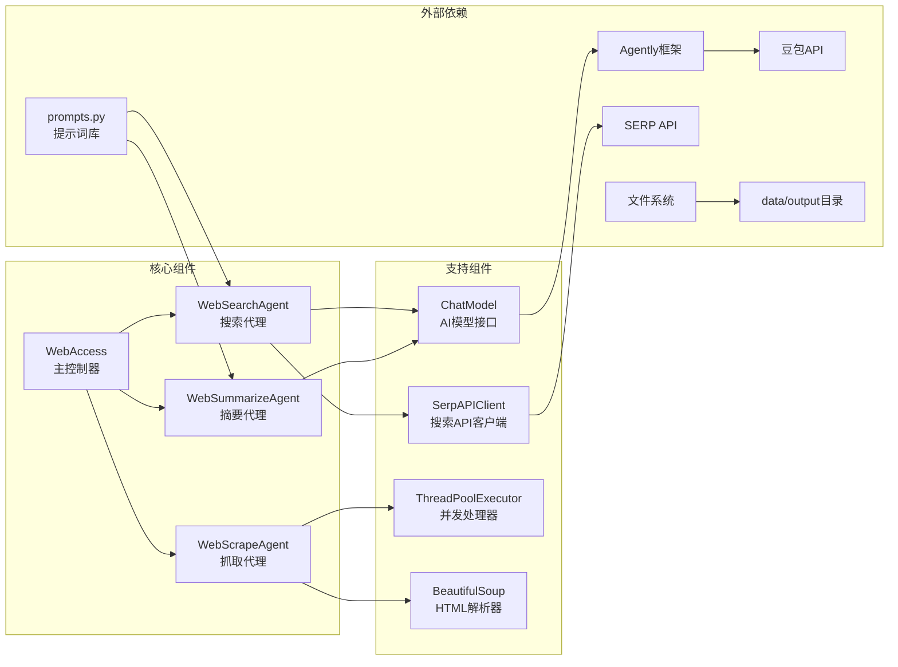

# Web Access 智能网络搜索工作流说明文档

## 概述

Web Access 是一个基于智能代理的网络搜索、抓取和摘要生成工作流系统。该系统通过搜索代理（SearchAgent）、抓取代理（ScrapeAgent）和摘要代理（SummarizeAgent）的协作，实现从用户查询到最终摘要的完整信息处理流程。

### 核心理念

- **流水线处理**：通过搜索→抓取→摘要的三阶段流水线，确保信息处理的完整性
- **智能代理协作**：每个代理专注于特定任务，职责明确，协作高效
- **数据持久化**：完整记录每个阶段的处理结果，支持追溯和分析
- **并发优化**：支持多线程并发抓取，提升处理效率

## 系统架构



## 核心组件

### 1. WebAccess（主控制器）
- **职责**：协调整个工作流的执行
- **功能**：
  - 管理三个代理的执行顺序
  - 清理输出文件夹
  - 统一异常处理和日志记录
  - 控制整体流程状态

### 2. WebSearchAgent（搜索代理）
- **职责**：智能搜索查询优化和执行
- **功能**：
  - 使用AI模型优化用户查询
  - 提取搜索关键词
  - 调用SERP API执行搜索
  - 保存搜索结果到JSON文件

### 3. WebScrapeAgent（抓取代理）
- **职责**：网页内容抓取和处理
- **功能**：
  - 从搜索结果中提取URL列表
  - 并发抓取网页内容
  - 清理和格式化文本内容
  - 保存抓取结果到文本文件

### 4. WebSummarizeAgent（摘要代理）
- **职责**：内容摘要生成和引用管理
- **功能**：
  - 读取抓取的网页内容
  - 使用AI模型生成结构化摘要
  - 添加适当的引用链接
  - 保存最终摘要结果

### 5. SerpAPIClient（搜索API客户端）
- **职责**：与SERP API的交互接口
- **功能**：
  - 封装SERP API调用
  - 处理搜索参数和响应
  - 错误处理和重试机制
  - 结果格式化和保存

## 详细流程说明

### 第一阶段：智能搜索
1. **查询优化**
   - 使用 `SEARCH_SYSTEM` 和 `SEARCH_USER` 提示词
   - AI模型分析用户查询意图
   - 提取关键搜索词和地理位置信息

2. **执行搜索**
   - 调用SERP API进行Google搜索
   - 获取前8个有机搜索结果
   - 保存为 `data/output/search/{hash}.json`

### 第二阶段：内容抓取
1. **并发抓取**
   - 读取搜索结果中的URL列表
   - 使用ThreadPoolExecutor进行并发抓取
   - 最大5个并发线程，避免服务器过载

2. **内容处理**
   - 使用BeautifulSoup解析HTML
   - 提取标题、段落等文本内容
   - 清理多余空格和格式字符
   - 保存为 `data/output/scrape/{hash}.txt`

### 第三阶段：摘要生成
1. **内容分析**
   - 读取抓取的网页内容
   - 使用 `SUMMARIZE_SYSTEM` 和 `SUMMARIZE_USER` 提示词
   - AI模型生成结构化摘要

2. **引用管理**
   - 为重要信息添加来源引用
   - 统一管理引用链接
   - 保存为 `data/output/summarize/{hash}.txt`

## 文件结构

```
web_access/
├── main.py              # 主程序入口和WebAccess类
├── search.py            # WebSearchAgent搜索代理
├── scrape.py            # WebScrapeAgent抓取代理
├── summarize.py         # WebSummarizeAgent摘要代理
├── serp.py              # SerpAPIClient搜索API客户端
├── prompts.py           # 提示词定义
├── data/                # 数据存储目录
│   └── output/          # 输出文件目录
│       ├── search/      # 搜索结果文件
│       ├── scrape/      # 抓取内容文件
│       └── summarize/   # 摘要结果文件
└── __pycache__/         # Python缓存文件
```

## 配置和使用

### 环境要求
- Python 3.8+
- Agently 框架
- 豆包 API 密钥
- SERP API 密钥
- requests, beautifulsoup4, python-dotenv

### 基本使用

```python
from web_access.main import WebAccess

# 创建工作流实例
web_access = WebAccess()

# 执行完整流程
query = "特朗普是否来中国参加9.3阅兵"
location = ""
web_access.run(query, location)
```

### 单独使用各组件

```python
# 仅执行搜索
from web_access.search import WebSearchAgent
search_agent = WebSearchAgent()
search_agent.run("中美贸易战的影响", "")

# 仅执行抓取
from web_access.scrape import WebScrapeAgent
scrape_agent = WebScrapeAgent()
scrape_agent.run("中美贸易战的影响", "")

# 仅执行摘要
from web_access.summarize import WebSummarizeAgent
summarize_agent = WebSummarizeAgent()
summarize_agent.run("中美贸易战的影响")
```

## 特性和优势

### 1. 智能查询优化
- 使用AI模型理解用户意图
- 自动提取最佳搜索关键词
- 支持地理位置相关搜索

### 2. 高效并发处理
- 多线程并发抓取网页内容
- 智能延迟机制避免服务器过载
- 异常处理确保流程稳定性

### 3. 结构化数据管理
- 统一的文件命名规则（MD5哈希）
- 分阶段数据存储和管理
- 支持数据追溯和调试

### 4. 智能摘要生成
- AI驱动的内容摘要
- 自动引用管理
- 结构化输出格式

## 应用场景

- 新闻事件的快速调研和摘要
- 学术研究的背景资料收集
- 市场分析和竞品调研
- 任何需要从网络获取和整理信息的场景

## 技术细节

### 提示词设计原则

系统采用了专业的提示词体系：

1. **搜索优化**：将AI定位为"Google Search 搜索查询助手"
2. **摘要生成**：定位为"内容摘要助手"，强调引用和结构化
3. **任务明确**：每个提示词都有明确的职责和输出要求
4. **格式规范**：统一的输出格式便于后续处理

### 文件命名机制

使用MD5哈希确保文件名的唯一性和一致性：

```python
def generate_filename(query: str, extension: str) -> str:
    encoded_query = query.encode('utf-8')
    filename = hashlib.md5(encoded_query).hexdigest()
    return f"{filename}.{extension}"
```

### 并发抓取优化

使用ThreadPoolExecutor实现高效并发：

```python
with ThreadPoolExecutor(max_workers=5) as executor:
    future_to_result = {
        executor.submit(self.scrape_with_delay, result, i): result 
        for i, result in enumerate(results)
    }
```

### 错误处理和日志

系统集成了完善的错误处理：

- 使用loguru进行结构化日志记录
- 每个关键操作都有异常捕获
- 超时处理避免长时间等待
- 详细的错误信息便于调试

## 性能优化建议

1. **缓存机制**：可以添加搜索结果缓存，避免重复查询
2. **批量处理**：支持批量查询处理模式
3. **代理池**：使用代理池避免IP限制
4. **异步处理**：考虑使用asyncio进一步提升并发性能

## 扩展开发

### 添加新的搜索引擎

```python
class BingSearchClient:
    """新增Bing搜索客户端"""
    def __init__(self, api_key: str):
        self.api_key = api_key
        self.base_url = "https://api.bing.microsoft.com/v7.0/search"
    
    def search(self, query: str) -> dict:
        # Bing搜索实现
        pass
```

### 自定义内容处理器

```python
class CustomContentProcessor:
    """自定义内容处理器"""
    def process_content(self, content: str) -> str:
        # 自定义内容处理逻辑
        pass
```

### 集成其他AI模型

修改ChatModel类以支持其他AI服务：

```python
def get_agent_factory(self, model_source="openai"):
    if model_source == "openai":
        # OpenAI 配置
        pass
    elif model_source == "claude":
        # Claude 配置
        pass
```

## 常见问题

### Q: 如何处理网站反爬虫机制？
A: 系统已内置延迟机制和超时处理，可以通过调整MAX_WORKERS和延迟时间来应对。

### Q: 如何自定义摘要格式？
A: 修改prompts.py中的SUMMARIZE_SYSTEM提示词即可。

### Q: 如何处理大量查询？
A: 可以实现批量处理模式，或者使用队列系统进行任务调度。

### Q: 如何提高抓取成功率？
A: 可以添加User-Agent轮换、代理池、重试机制等功能。


